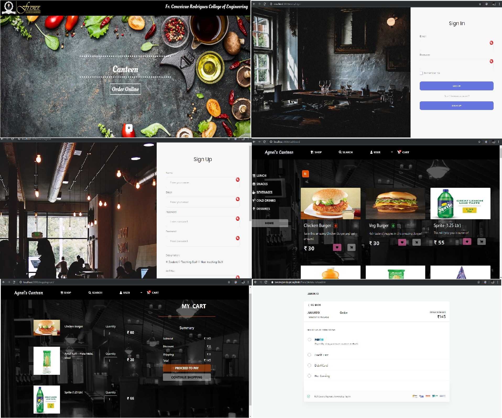
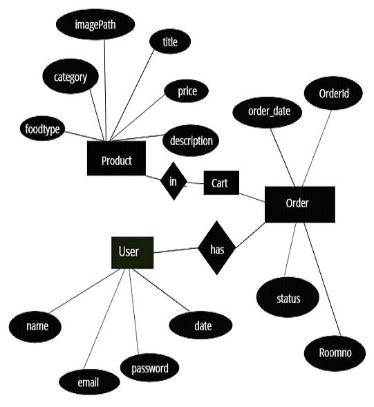

# Canteen-eCommerce-Website
This repository serves as the repo for Web Technology college mini-project.

# Table of Contents

* [Description](https://github.com/amurto/college-canteen-ecommerce#description)
* [Dependencies](https://github.com/amurto/college-canteen-ecommerce#dependencies)
* [Installation](https://github.com/amurto/college-canteen-ecommerce#installation)
  * [Prerequisites](https://github.com/amurto/college-canteen-ecommerce#prerequisites)
  * [Instructions](https://github.com/amurto/college-canteen-ecommerce#instructions)
* [Usage](https://github.com/amurto/college-canteen-ecommerce#usage)
* [Contributors](https://github.com/amurto/college-canteen-ecommerce#contributors)
* [License](https://github.com/amurto/college-canteen-ecommerce#license)

# Description

The Project "Canteen eCommerce Web App" enables the end users to register online, read and select the food from e-menu card and order food online by just selecting the food that the user want to have using android application. The results after selecting the food from the E-menu card will directly appear on the screen near the Chef who is going to cook the food for you. 

The system is the combination of Android as well as Web Application. By using this application the work of the waiter is reduced and we can also say that the work is nullified. The benefit of this is that if there is a rush in the Canteen then there will be chances that the waiters will be unavailable and the users can directly order the food to the chef online by using this application. The user will have a username and a password, by using which they can login into the system. This implies that the customer is the regular user of the Canteen.

The manual system involves paperwork in the form of maintaining various files and manuals. Maintaining critical information in the files and manuals is full of risk and a tedious process. Including a framework showing how to apply Internet technology progressively as skills and confidence grow, the project demonstrates the route from adapting materials to developing an online environment.

Nowadays people don't have much time to spend in canteen by just there and waiting for the waiter to take their order. Many customers visit the canteen in their lunch break and recess so they have limited time to eat and return to their respective office and colleges. So this software helps them to save time and order food whenever they want without calling the waiter again and again.

 
### Website Images


### ER Diagram


# Dependencies

* [npm](https://www.npmjs.com/)
* [Express.js](https://expressjs.com/)
* [MongoDB](https://reactjs.org/)
* [Paytm API](https://developer.paytm.com/docs/)

# Installation

### Prerequisites

Install Node.js and npm using the link above. Follow instructions on their respecive websites. Npm is included with Node.js. Setup MongoDB locally or on [MongoDB Atlas](https://www.mongodb.com/cloud/atlas) and get the connection string. This connection string has to be pasted in both configs of [Admin](https://github.com/amurto/college-canteen-ecommerce/blob/master/admin-canteen/config/keys.js) and [Client](https://github.com/amurto/college-canteen-ecommerce/blob/master/client-canteen/config/keys.js). Get Paytm API key for developers and paste these keys in the [.env](https://github.com/amurto/college-canteen-ecommerce/blob/master/client-canteen/.env) file in client-canteen folder.

### Instructions

Clone the repository
```bash
git clone https://github.com/amurto/college-canteen-ecommerce.git
```

Install all the dependencies on admin server
```bash
cd admin-canteen 
npm install
```

Install all the dependencies on client server
```bash
cd admin-canteen 
npm install
```

# Usage

Run the admin server
```bash
cd admin-canteen
npm run dev
```

Open a web browser and go to
```bash
http://localhost:3000
```

Run the client server
```bash
cd client-canteen
npm run dev
```

Open a web browser and go to
```bash
http://localhost:5000
```

# Contributors

* [@amurto](https://github.com/amurto)
* [@mahesh131998](https://github.com/mahesh131998)
* [@mishrashubham17](https://github.com/mishrashubham17)
* [@Sarvesh-Kulkarni](https://github.com/Sarvesh-Kulkarni)

# License

[](https://opensource.org/licenses/MIT)

[MIT License Link](https://github.com/amurto/college-canteen-ecommerce/blob/master/LICENSE)